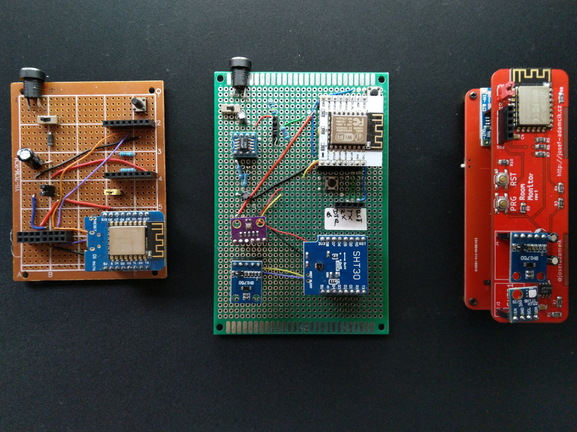

# RoomMonitor

Software/firmware for DYI room conditions monitor. 

- ESP8266 wifi connection & brain
- SHT30 or SHT21 - temperature and humidity sensor
- BMP280 - atmospheric pressure sensor (optional)
- BH1750 - light intensity sensor.

All sesnors communicate via I2C bus. Data are sent to a MQTT broker.



PlatformIO is used to build this project but it should be easy to convert it back to a project for Arduino IDE.

More information can be found in this series of blog posts:

- [ESP8266 based room-conditions monitor, Part 1](https://josef-adamcik.cz/electronics/esp8266-based-room-conditions-monitor-part-1.html)
- [ESP8266 based room-conditions monitor, part 2: PCB](https://josef-adamcik.cz/electronics/esp8266-based-room-conditions-monitor-part-2.html)

There is also another projects for a remote MQTT display for measured data:

- [Github project RoomMonitorClient](https://github.com/josefadamcik/RoomMonitorClient)
- blog post [Freeform ESP8266 OLED MQTT client](https://josef-adamcik.cz/electronics/freeform-esp8266-based-mqtt-oled-client.html)


## Flashing the device

## Config

- change the name of the room in config.h
- setup IP and port for MQTT server in main.cpp

```
const char mqttServer[] = "192.168.178.31";
const int mqttServerport = 1883; 
```

- setup IP for the device and network details in main.cpp

```
IPAddress ip(192, 168, 178, 51);
IPAddress gateway(192, 168, 178, 1);
IPAddress subnet(255, 255, 255, 0);
```


### First flash 

- use the programming breakout J1 on the board
- check the layout in the schematic
- hold PRG button and pres RST to get into programming mode

### OTA

You need to know IP of the device.

Setup in `platformio.ini` as this:

```
platform = espressif8266
board = esp12e
framework = arduino
upload_protocol = espota
upload_port = 192.168.178.51
```

- Restart the device and press shortly PRG after restart. The device will switch into "waiting for OTA" mode.
- Run upload through platformio.

